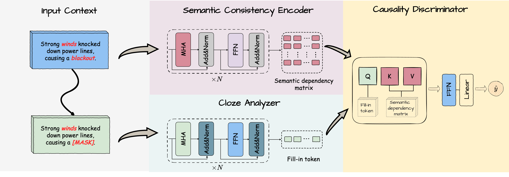
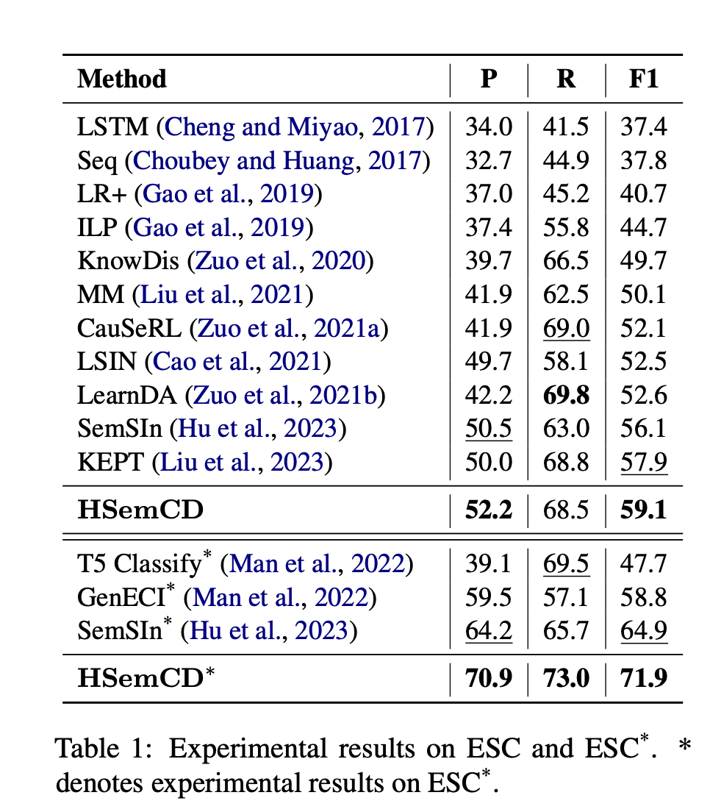
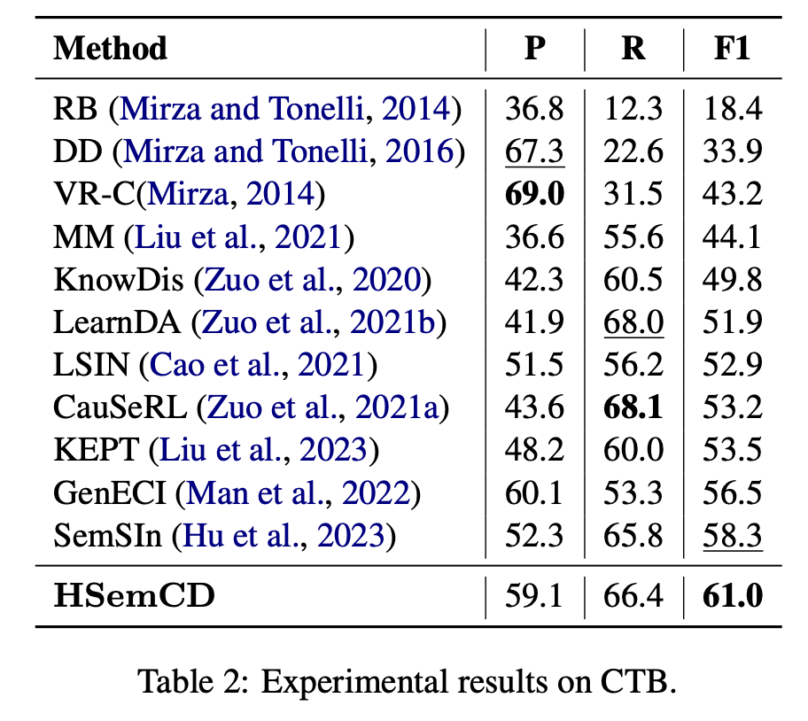

# Advancing Event Causality Identification via Heuristic Semantic Consistency Inquiry Network

This repository is the official Pytorch implementation of HSemCD.


## Overview



Event Causality Identification (ECI) focuses on extracting causal relations between events in texts. Existing methods primarily utilize causal features and external knowledge to identify causality. However, such approaches fall short in two dimensions: (1) the causal features between events in a text often lack explicit clues, and (2) external knowledge may introduce bias, while specific problems require specific analyses. In light of these issues, we introduce a novel **Semantic Consistency Inquiry (SemCI)** to the ECI task and propose the **H**euristic **Sem**antic **C**onsistency **D**iscriminator (HSemCD), a model that is both straightforward and effective. HSemCD utilizes a *Cloze* Analyzer to facilitate a gap-filling game, aiming to help uncover the semantic dependency in the context. Subsequently, it assesses the semantic consistency between the fill-in token and the given sentence to detect the existence of causality. Through this assessment, HSemCD reveals the causal relations between events indirectly. Comprehensive experiments validate the effectiveness of HSemCD, which surpasses previous state-of-the-art methods on three widely used benchmarks.


## Requirements

To install requirements:

```setup
pip install -r requirements.txt
```

## A Quick Checkout

We have provided a jupyter notebook to run fast evaluation on ESC, ESC<sup>*</sup>, and CTB:

```eval
src/evaluate_demo.ipynb
```

## Getting Started

### Data:
We have provided the processed data in `src/dataset`

The raw data can be found at:

(1) EventStoryLine v0.9 (ESC): [https://github.com/tommasoc80/EventStoryLine](https://github.com/tommasoc80/EventStoryLine)

(2) Causal-TimeBank (CTB): [https://github.com/paramitamirza/Causal-TimeBank](https://github.com/paramitamirza/Causal-TimeBank)


### Training

Go to the `src` folder and run the scripts to start training: 

(1) ESC: ```sh train_ESC.sh```

(2) ESC<sup>*</sup>: `sh train_ESCstar.sh`

(3) CTB: `sh train_CTB.sh`

> If the paper is accepted, we will release the full version, i.e., the total processed data for training.


### Results

As a simple and effective approach, our HSemCD outperforms previous SOTA algorithms by a significant margin:

 


